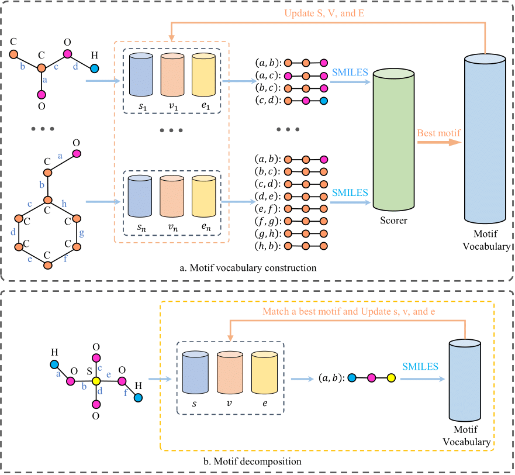
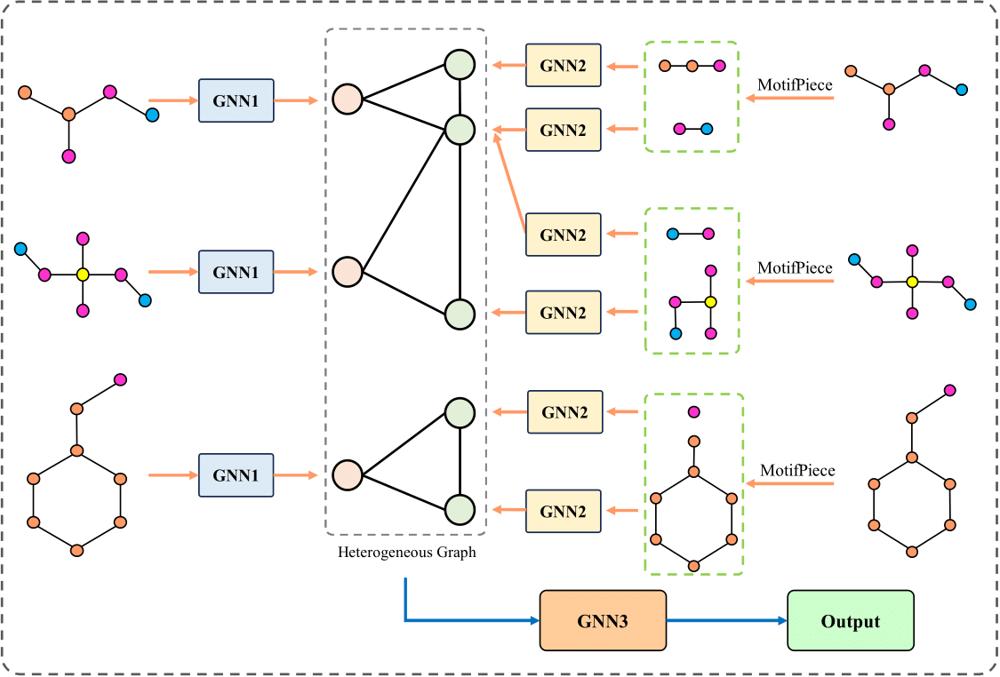
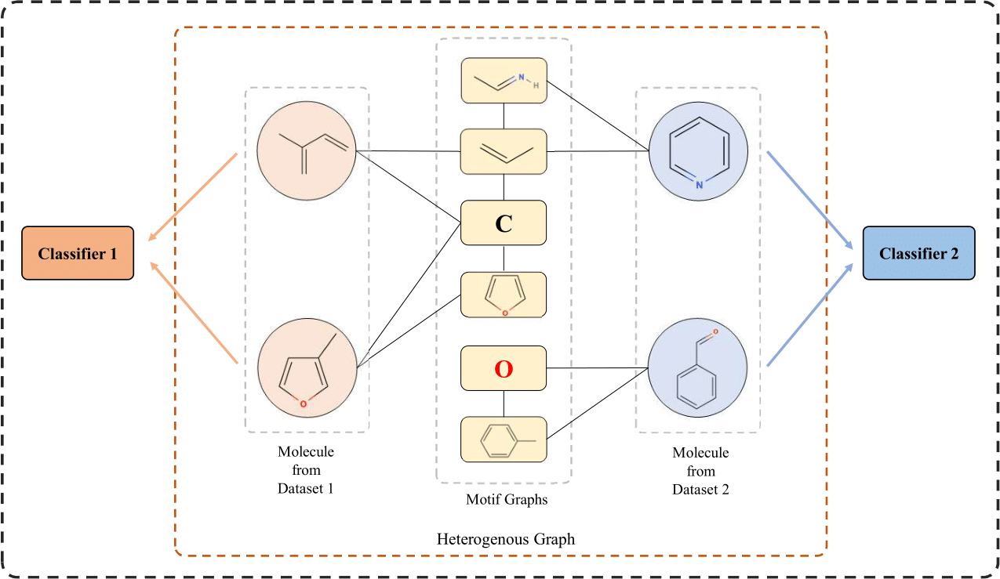

# MotifPiece

## MotifPiece Algorithm



## Heterogeneous Graph Learning Module



## Cross Datasets Learning Module



## Installation

### Environment setup

We highly recommend installing [Anaconda](https://docs.anaconda.com/free/anaconda/install/index.html) for a simple environment setup and management.

Required Libraries:
> pytorch
> pytorch geometric
> pyg_lib 
> torch_sparse
> rdkit
> ogb
> pandas
> scikit-learn

Download our project:
```bash
git clone https://github.com/ZhaoningYu1996/MotifPiece.git
cd MotifPiece
```

Create a virtual environment with requirement packages:
```bash
conda env create -f environment.yml
```

If this does not work, you can also install environment follow below commands:
```bash
conda create myEnv python=3.9
conda activate myEnv
pip3 install torch torchvision torchaudio
pip install torch_geometric
pip install pyg_lib torch_scatter torch_sparse torch_cluster torch_spline_conv -f https://data.pyg.org/whl/torch-${TORCH}+${CUDA}.html
pip install rdkit
pip install ogb
pip install pandas
pip install scikit-learn
```

Activate the virtual environment:
```bash
conda activate motifpiece
```

### Usage

To reproduce the results of running single dataset from the paper:
```bash
python main.py --data_name --threshold --score_method --merge_method --decomposition_method
```

To reproduce the results of cross datasets learning from the paper:
```bash
python cross_dataset_mol.py   # Datasets in MoleculeNet
python cross_dataset_ptc.py   # PTC datasets
```

To apply MotifPiece and extract motifs on a personal SMILES representation dataset, you can use MotifPiece class in motifpiece.py:
```bash
motifpiece = MotifPiece(*args)
```
In `*args`, you can setup `threshold`, `score_method`, and `merge_method`. You can also setup `train_indices` to only extract motifs from the training set.